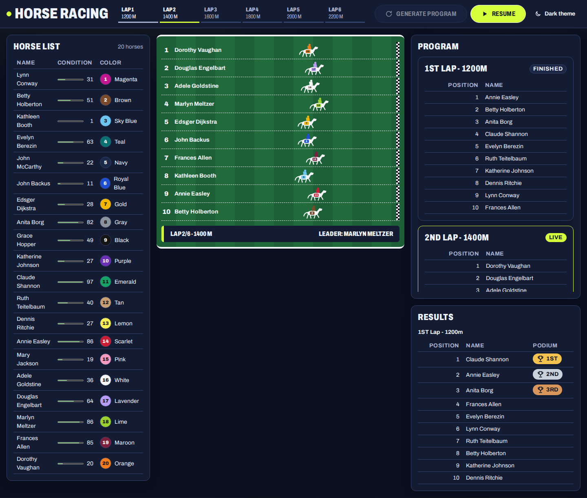
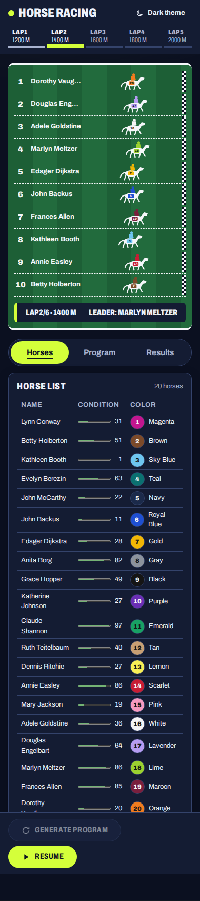

# Horse Racing

An interactive horse racing game built with Vue 3, TypeScript and Pinia for the Insider One frontend assessment. Generate a program of six laps from 1200 to 2200 meters and watch ten of twenty horses race each lap.

[](https://github.com/phosimurg/horse-racing-game/actions/workflows/ci.yml)

**[Live demo](https://phosimurg.github.io/horse-racing-game/)**, which needs no setup.

## Features

- A roster of 20 horses, each with a unique silk color and a condition score from 1 to 100.
- A program of 6 laps at 1200, 1400, 1600, 1800, 2000 and 2200 meters, with 10 horses drawn per lap.
- One race control that reads Start, Pause or Resume, and laps that run one after another with a short intermission.
- Animated runners with a four-beat gallop, driven by CSS transforms only.
- Results published lap by lap with podium markers, announced to assistive technology.
- Dark and light themes, a layout that reflows to a single column with tabs below 768 pixels, and full keyboard access.
- Deterministic races: add `?seed=20260915` to the URL to reproduce the same horses, program and results.

## Screenshots

| Desktop, dark theme                                                                                               | Phone, dark theme                                                                                             |
| ----------------------------------------------------------------------------------------------------------------- | ------------------------------------------------------------------------------------------------------------- |
|  |  |

Both images are visual regression baselines, so they always show what the tests assert.

## Quick start

Node.js `^22.22.2`, `^24.15.0` or `>=26.0.0` is required. The repository sets `engine-strict`, so an older Node stops `npm ci` with `npm error code EBADENGINE` instead of installing. `.nvmrc` pins the version used in CI:

```bash
nvm install && nvm use
```

```bash
npm ci
```

```bash
npm run dev
```

The development server prints its URL, by default http://localhost:5173.

## Scripts

| Command                      | Purpose                                                                          |
| ---------------------------- | -------------------------------------------------------------------------------- |
| `npm run dev`                | Start the development server                                                     |
| `npm run build`              | Type-check and build for production                                              |
| `npm run verify`             | Lint, format check, type-check, unit tests with coverage, build and traceability |
| `npm run test:unit`          | Unit and component tests with Vitest                                             |
| `npm run test:e2e`           | End-to-end tests with Playwright (run `npx playwright install` once first)       |
| `npm run test:visual:docker` | Visual regression tests inside the official Playwright image                     |
| `npm run test:mutation`      | Mutation tests over `src/domain` with Stryker                                    |
| `npm run traceability`       | Check that every requirement ID appears in a test title                          |

## Architecture

The layers below depend only downwards, and ESLint enforces the boundaries.

| Layer                                        | Responsibility                                                     |
| -------------------------------------------- | ------------------------------------------------------------------ |
| `src/domain`                                 | Pure rules and simulation: horses, program, race, seeded random    |
| `src/stores`                                 | Pinia stores for the roster and the race lifecycle                 |
| `src/composables`                            | Per-frame playback, RNG injection, theme, media queries, announcer |
| `src/components/ui`, `src/components/common` | Presentational components: props in, events out                    |
| `src/views/RaceDashboard`                    | The only layer that reads stores and composables                   |

The domain has no Vue, Pinia or DOM imports, so the simulation could move to a server unchanged. Races are computed up front from a seeded generator, and playback only interpolates positions, which keeps the animation deterministic and testable.

## Testing

| Level              | Tool                      | Scope                                         |
| ------------------ | ------------------------- | --------------------------------------------- |
| Unit and property  | Vitest                    | `src/domain` at 100% coverage                 |
| Mutation           | Stryker                   | `src/domain`, score of at least 80            |
| Component and view | Vitest and Vue Test Utils | Components and the dashboard view             |
| End-to-end         | Playwright                | Chromium full suite, Firefox and WebKit smoke |
| Accessibility      | `@axe-core/playwright`    | Both themes, desktop and mobile               |
| Visual regression  | Playwright screenshots    | 10 baselines in the official Docker image     |

Screenshots are compared only inside `mcr.microsoft.com/playwright:v1.63.0-noble` on arm64, both locally and in CI. See [e2e/visual/README.md](e2e/visual/README.md) for the baseline update procedure.

## Documentation

- [Case study questions and answers](docs/case-study-qa.md)
- [Audit results](docs/audits.md)
- [Requirements](docs/specs/requirements.md)
- [Design](docs/specs/design.md)
- [Tasks](docs/specs/tasks.md)
- [Architecture decisions](docs/adr/)
- [AI-assisted workflow log](docs/ai-workflow.md)
