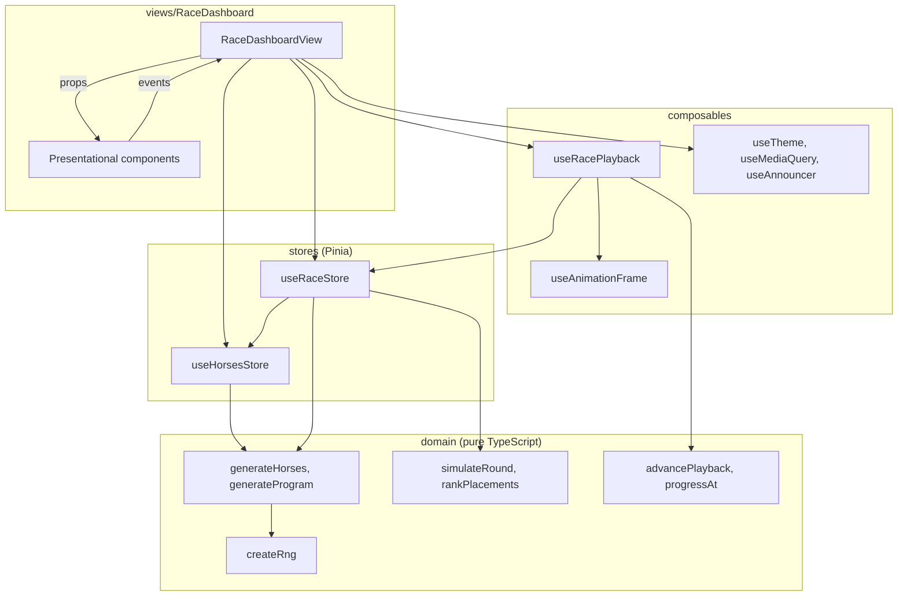
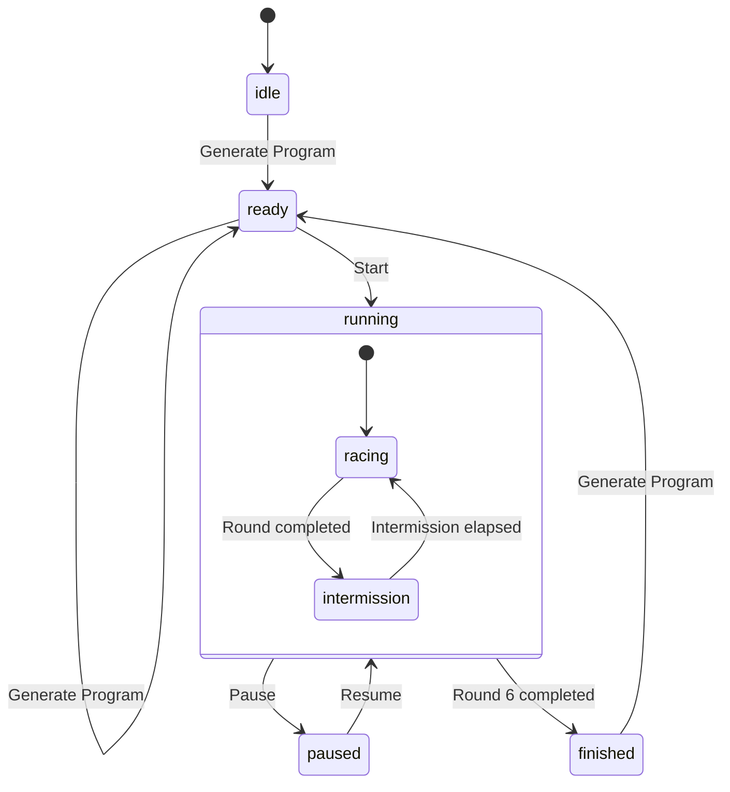

# Design Specification

| Field        | Value                                                                                                                                                                              |
| ------------ | ---------------------------------------------------------------------------------------------------------------------------------------------------------------------------------- |
| Status       | Approved with author decisions                                                                                                                                                     |
| Last updated | 2026-09-14                                                                                                                                                                         |
| Requirements | [requirements.md](requirements.md)                                                                                                                                                 |
| Decisions    | [ADR 0001](../adr/0001-architecture-and-state-ownership.md), [ADR 0002](../adr/0002-race-simulation-and-determinism.md), [ADR 0003](../adr/0003-testing-strategy-and-toolchain.md) |

## 1. Goals

- Meet every brief requirement with behavior that is deterministic, testable and explainable.
- Keep business rules framework-agnostic so they can move, for example to a server, without rewrites.
- Deliver a distinctive, accessible and responsive interface built on an in-house design system.

## 2. Architecture



### 2.1 Layer rules

Enforced with ESLint `no-restricted-imports` and `no-restricted-globals`. Helpers in `src/test` are for `*.spec.ts` files only, which `no-restricted-syntax` enforces in every layer.

| Layer                                     | May import                                   | Must not import                                |
| ----------------------------------------- | -------------------------------------------- | ---------------------------------------------- |
| `domain`                                  | `domain`                                     | Vue, Pinia, DOM globals, any other `src` layer |
| `stores`                                  | `domain`, other stores, `composables/useRng` | components, views                              |
| `composables`                             | `domain`, `stores`, `utils`                  | components, views                              |
| `components/ui`                           | `utils`                                      | `domain`, `stores`, `composables`              |
| `components/common`, `views/*/components` | `components`, `domain`, `utils`              | `stores`, `composables`                        |
| `views/*/*View.vue`                       | Everything above                             |                                                |

Only the view reads stores and calls composables; every other component is props in, events out.

### 2.2 Project structure

```
src/
  main.ts                 bootstrap: Pinia, RNG provide, errorHandler, fonts, global styles
  App.vue                 renders RaceDashboardView
  domain/
    random/               random.types, createRng (mulberry32), randomInt, sampleWithoutReplacement
    horse/                horse.types, horse.constants (count, condition bounds, name pool, 20 named silk colors), generateHorses
    race/                 race.types, race.constants, generateProgram, simulateRound, rankPlacements, progressAt, advancePlayback
    index.ts              public API
  stores/                 horses.ts, race.ts
  composables/            useRng, useAnimationFrame, useRacePlayback, useTheme, useMediaQuery, useAnnouncer
  components/ui/          BaseButton, BaseCard, BaseTable, BaseTabs, BaseBadge, SkipLink, LiveAnnouncer
  components/common/      HorseRunner, SilkChip, ConditionMeter, RoundCard, ThemeToggle
  views/RaceDashboard/    RaceDashboardView.vue, components/ (AppBar, LapStepper, RaceControls, HorseRoster, RaceTrack, RaceLane, ProgramPanel, ResultsPanel, MobileActionBar)
  utils/                  formatLapTitle, contrastRatio, readableTextColor, resolveSeed
  styles/                 layers.css, tokens.css, base.css, utilities.css
  test/                   setup, stubRng, createTestStores
e2e/                      fixtures, behavior specs, visual/
scripts/                  check-traceability.mjs
```

Unit and component tests sit next to their source as `*.spec.ts`.

## 3. Domain contracts

```ts
type HorseId = number;

interface HorseColor {
  readonly name: string;
  readonly hex: string;
}

interface Horse {
  readonly id: HorseId;
  readonly name: string;
  readonly color: HorseColor;
  readonly condition: number;
}

interface Round {
  readonly number: number;
  readonly distance: number;
  readonly horseIds: readonly HorseId[]; // lane = index + 1
}

interface HorseRun {
  readonly horseId: HorseId;
  readonly lane: number;
  readonly checkpointsMs: readonly number[]; // cumulative, one per segment; last = finish time
}

interface RoundSimulation {
  readonly round: Round;
  readonly runs: readonly HorseRun[];
  readonly durationMs: number;
}

interface RaceProgram {
  readonly rounds: readonly Round[];
  readonly simulations: readonly RoundSimulation[];
}

interface Placement {
  readonly position: number;
  readonly horseId: HorseId;
  readonly finishTimeMs: number;
}

interface RoundResult {
  readonly roundNumber: number;
  readonly distance: number;
  readonly placements: readonly Placement[];
}

type RaceStatus = 'idle' | 'ready' | 'running' | 'paused' | 'finished';

interface PlaybackState {
  readonly roundIndex: number;
  readonly phase: 'racing' | 'intermission';
  readonly elapsedMs: number;
}

interface PlaybackStep {
  readonly state: PlaybackState;
  readonly completedRoundIndexes: readonly number[];
  readonly isFinished: boolean;
}

interface Rng {
  next(): number; // [0, 1)
}

declare function createRng(seed: number): Rng;
declare function randomInt(min: number, max: number, rng: Rng): number; // integer in [min, max]
declare function sampleWithoutReplacement<T>(items: readonly T[], count: number, rng: Rng): T[];
declare function generateHorses(rng: Rng): Horse[];
declare function generateProgram(horses: readonly Horse[], rng: Rng): RaceProgram;
declare function simulateRound(
  round: Round,
  horsesById: ReadonlyMap<HorseId, Horse>,
  rng: Rng
): RoundSimulation;
declare function rankPlacements(simulation: RoundSimulation): Placement[];
declare function progressAt(run: HorseRun, elapsedMs: number): number; // 0..1
declare function advancePlayback(
  state: PlaybackState,
  deltaMs: number,
  program: RaceProgram
): PlaybackStep;
```

### 3.1 Invariants

- `createRng` returns the same sequence for the same seed, and every value is in [0, 1).
- `randomInt` returns an integer from `min` to `max` inclusive and consumes one draw.
- `sampleWithoutReplacement` returns the entries at `count` distinct positions of `items` in draw order, consumes `count` draws and never mutates `items`.
- `generateHorses` returns 20 horses with ids 1 to 20, unique names, unique colors and integer conditions from 1 to 100, and consumes 60 draws.
- `HORSE_NAMES` holds 40 unique, non-blank names; `SILK_COLORS` holds 20 colors with unique, non-blank names and unique lowercase `#rrggbb` hex values.
- Every `SILK_COLORS` hex reaches a WCAG 2.2 contrast ratio of at least 4.5:1 against `#151515` or against `#f5f5f5`, so bib text at least that dark or that light stays readable.
- `generateProgram` returns 6 rounds numbered 1 to 6 with distances from 1200 to 2200 in 200 m steps, 10 distinct horses per round and one simulation per round, whose `round` is that round.
- `simulateRound` returns one run per horse in lane order, with `lane` equal to the horse's index in `horseIds` plus 1, and consumes `1 + distance / SEGMENT_LENGTH_M` draws per horse.
- Every `checkpointsMs` list is strictly increasing and has `distance / SEGMENT_LENGTH_M` entries.
- `durationMs` equals the largest finish time in its round.
- `rankPlacements` assigns positions from 1 to the number of runs exactly once, ordered by finish time (the last checkpoint), ties broken by lane.
- `progressAt` is 0 at or before 0 ms, 1 at or after the finish time and non-decreasing in between. It is linear within each segment, so it equals k / n at the kth of n checkpoints.
- `advancePlayback` never loses or double-counts elapsed time across phase or round boundaries, and never reports a round twice.
- `advancePlayback` reports completed rounds in order and changes nothing for a delta of 0. When the last round completes it returns `isFinished` with the state held at that round's `durationMs`; a finished state stays unchanged.

### 3.2 Input validation

Public domain functions throw an `Error` whose message starts with the function name and names the violated rule, for example `createRng: seed must be an integer from 0 to 4294967295, received -1`.

| Function                   | Rejects                                                                                                                                                             |
| -------------------------- | ------------------------------------------------------------------------------------------------------------------------------------------------------------------- |
| `createRng`                | A seed that is not an integer from 0 to 4294967295                                                                                                                  |
| `randomInt`                | Bounds that are not safe integers, `min` greater than `max`, or a range of more than 2^32 integers                                                                  |
| `sampleWithoutReplacement` | A count that is not an integer from 0 to `items.length`                                                                                                             |
| `simulateRound`            | A round without horses, a horse id missing from `horsesById`, or a distance that is not a positive multiple of `SEGMENT_LENGTH_M`                                   |
| `generateProgram`          | Fewer than `HORSES_PER_ROUND` horses, or two horses with the same id                                                                                                |
| `advancePlayback`          | A negative or non-finite `deltaMs`, a state with a negative or non-finite `elapsedMs` or a round index outside the program, or an intermission after the last round |

## 4. Race simulation

### 4.1 Model

A round is split into segments of `SEGMENT_LENGTH_M`. For horse `h`, round `r` and segment `s`:

```
speed(h, r, s)     = BASE_SPEED_MPS * conditionFactor(h) * form(h, r) * jitter(h, r, s)
conditionFactor(h) = MIN_CONDITION_FACTOR + (1 - MIN_CONDITION_FACTOR) * condition(h) / 100
form(h, r)         uniform in [1 - FORM_VARIANCE, 1 + FORM_VARIANCE], drawn once per horse per round
jitter(h, r, s)    uniform in [1 - SEGMENT_JITTER, 1 + SEGMENT_JITTER], drawn once per segment
segmentMs          = SEGMENT_LENGTH_M / speed * 1000 / PLAYBACK_SPEED
```

Jitter averages out over 12 to 22 segments, because its spread shrinks with the square root of the segment count, so it creates lead changes within a round without deciding it. A small `form` factor allows occasional upsets between closely matched horses while condition stays dominant (decision D7).

A uniform factor with spread `v` is computed as `1 + v * (2 * next() - 1)`, so a draw of 0.5 gives exactly 1.

### 4.2 Constants

The simulation constants were calibrated in HRG-23 against section 4.3 and kept their initial values.

| Constant                         | Value                                               | Purpose                                                  |
| -------------------------------- | --------------------------------------------------- | -------------------------------------------------------- |
| `HORSE_COUNT`                    | 20                                                  | Rule 1                                                   |
| `HORSES_PER_ROUND`               | 10                                                  | Rule 5                                                   |
| `ROUND_DISTANCES_M`              | 1200, 1400, 1600, 1800, 2000, 2200                  | Rule 6                                                   |
| `CONDITION_MIN`, `CONDITION_MAX` | 1, 100                                              | Rule 3                                                   |
| `HORSE_NAMES`                    | 40 names of computing pioneers                      | Name pool; each roster draws 20 names without repeats    |
| `SILK_COLORS`                    | 20 named colors with lowercase `#rrggbb` hex values | Rule 2; each roster uses every color once                |
| `SEGMENT_LENGTH_M`               | 100                                                 | Simulation resolution                                    |
| `BASE_SPEED_MPS`                 | 16                                                  | Speed at condition 100 before randomness                 |
| `MIN_CONDITION_FACTOR`           | 0.82                                                | Share of base speed kept at condition 0                  |
| `FORM_VARIANCE`                  | 0.02                                                | Per-round form spread, kept small so condition dominates |
| `SEGMENT_JITTER`                 | 0.05                                                | Per-segment spread                                       |
| `PLAYBACK_SPEED`                 | 18                                                  | Simulated seconds per real second                        |
| `INTERMISSION_MS`                | 1500                                                | Pause between rounds                                     |
| `MAX_FRAME_DELTA_MS`             | 100                                                 | Upper bound for one frame's time step                    |

### 4.3 Calibration targets

Measured with a seeded Monte Carlo test over at least 2000 head-to-head rounds at 1200 m. For each gap, the lower condition cycles through every value that keeps both horses within 1 to 100, and the better horse alternates between lanes 1 and 2. Each observed win rate must sit at least 5 standard errors, computed from the observed rate and the round count, inside every finite bound of its band, so reordering random draws cannot flip the result.

| Condition gap     | Win rate of the better horse |
| ----------------- | ---------------------------- |
| 10 points         | 75% to 92%                   |
| 20 points         | At least 93%                 |
| 30 points or more | At least 99%                 |

Playback targets: winners finish in about 4 to 6 s at 1200 m and 7 to 10 s at 2200 m. Without randomness (every draw 0.5), horses with conditions 1 and 100 both finish inside those windows.

### 4.4 Determinism

- `createRng(seed)` implements mulberry32: a 32-bit generator that is fast and adequate for games, not for cryptography. `next()` divides each 32-bit output by 2^32.
- `randomInt(min, max, rng)` returns `min + floor(next() * (max - min + 1))`. A draw has 2^32 possible values, so ranges of more than 2^32 integers are rejected; results are exactly uniform only when the range size is a power of two.
- `sampleWithoutReplacement(items, count, rng)` selects and removes: each draw removes the entry at `randomInt(0, remaining.length - 1, rng)` from `remaining`, a copy of the entries not drawn yet, and appends it to the sample.
- `generateHorses(rng)` samples 20 names from `HORSE_NAMES`, then all 20 `SILK_COLORS`, both with `sampleWithoutReplacement`, then draws one condition per horse in id order with `randomInt(CONDITION_MIN, CONDITION_MAX, rng)`. Horse n gets the nth sampled name and color.
- `simulateRound(round, horsesById, rng)` draws, for each horse in lane order, its form and then one jitter per segment.
- `generateProgram(horses, rng)` draws the lineups of all six rounds first, each with `sampleWithoutReplacement(horses, HORSES_PER_ROUND, rng)` so that draw order gives lanes 1 to 10, and then simulates the rounds in order.
- Randomness is consumed in a fixed order and only at generation time: a roster at load, then a new roster, the rounds and all six simulations on each Generate Program. Playback consumes none, so pausing, frame rate and tab visibility cannot change results.
- `resolveSeed` accepts a decimal uint32 from `?seed=`; anything else falls back to `crypto.getRandomValues`.

## 5. State ownership

| State                            | Owner                          | Reason                                                                                           |
| -------------------------------- | ------------------------------ | ------------------------------------------------------------------------------------------------ |
| Roster                           | `useHorsesStore`               | Global; read by roster, program, results and track                                               |
| Program, results, race status    | `useRaceStore`                 | Global lifecycle; changes only on user actions and round boundaries                              |
| Playback clock, progress, leader | `useRacePlayback` (view scope) | Changes every frame; keeping it out of Pinia keeps devtools readable and store tests synchronous |
| Theme                            | `useTheme`                     | App preference persisted in `localStorage`                                                       |
| Layout mode                      | `useMediaQuery`                | Derived from the viewport                                                                        |
| Announcements                    | `useAnnouncer`                 | Transient messages for the live region                                                           |

### 5.1 Stores

Setup stores; the shapes below are what consumers see on the store instance.

```ts
interface HorsesStore {
  readonly horses: readonly Horse[];
  readonly horsesById: ReadonlyMap<HorseId, Horse>;
  generate(): void;
}

interface RaceStore {
  readonly status: RaceStatus;
  readonly program: RaceProgram | null;
  readonly results: readonly RoundResult[];
  readonly canGenerate: boolean;
  readonly canStart: boolean;
  generateProgram(): void;
  start(): void;
  pause(): void;
  toggle(): void;
  completeRound(roundIndex: number): void;
}
```

- `generateProgram` is a no-op while running or paused. In the other states it draws a new roster through `useHorsesStore().generate()`, builds a program from that roster and clears results, so one user action replaces both (decision D2).
- `completeRound(i)` is accepted only while running and only when `i` equals the number of stored results; any other call is a no-op. The sixth result moves the race to `finished`.
- `canStart` is true while the race control applies (ready, running or paused). `start()` runs a ready race or resumes a paused one, `pause()` pauses a running race, and `toggle()` calls whichever applies.
- `program` and `results` are `shallowRef`s holding immutable data.

### 5.2 Playback

```ts
interface RacePlayback {
  readonly activeRound: Round | null;
  readonly phase: 'racing' | 'intermission';
  readonly progressByHorseId: ReadonlyMap<HorseId, number>;
  readonly leaderId: HorseId | null;
}
```

Frame algorithm while `status === 'running'`:

1. `delta = min(timestamp - lastTimestamp, MAX_FRAME_DELTA_MS)`; the first frame after a start or resume uses 0.
2. `step = advancePlayback(state, delta, program)`.
3. Call `raceStore.completeRound(index)` for every index in `step.completedRoundIndexes`.
4. `state = step.state`.

On pause, finish or unmount the frame is cancelled and `lastTimestamp` is cleared. A new program resets the state to round 0, racing, 0 ms.

Round timeline: racing from 0 ms to `durationMs` (the last horse finishes and the result is published), then intermission for `INTERMISSION_MS`, then the next round starts. Leftover time carries across each boundary. A phase ends when its elapsed time reaches its duration, and the last round has no intermission. During an intermission every horse of the finished round shows progress 1. `leaderId` is null until a horse has moved; afterwards it is the horse with the most progress, ties broken by finish time and then lane, so a finished round names its winner.

### 5.3 RNG injection

`main.ts` calls `app.provide(RNG_KEY, createRng(resolveSeed(location.search)))`. Stores obtain it with `useRng()`, which throws a descriptive error when nothing is provided. `createTestStores({ seed })` builds an app with Pinia and a seeded RNG for store tests.

## 6. Race lifecycle



The complete state and event table, including no-ops, is in [requirements.md](requirements.md) section 6.

## 7. User experience

### 7.1 Screen states

| State                   | Track                                          | Program                                | Results                              | Race control    | Generate Program                        |
| ----------------------- | ---------------------------------------------- | -------------------------------------- | ------------------------------------ | --------------- | --------------------------------------- |
| `idle`                  | Guidance to generate a program                 | Guidance                               | Guidance                             | Start, disabled | Enabled                                 |
| `ready`                 | Round 1 horses at the start gate               | 6 racecards, all Upcoming              | Guidance that results appear per lap | Start           | Enabled; draws a new roster and program |
| `running`, racing       | Horses moving; lower third with lap and leader | Running round Live with `aria-current` | Completed laps                       | Pause           | Disabled                                |
| `running`, intermission | Finished round held at the line                | Finished round marked Finished         | Newest lap scrolled into view        | Pause           | Disabled                                |
| `paused`                | Frozen                                         | Unchanged                              | Unchanged                            | Resume          | Disabled                                |
| `finished`              | Round 6 held at the line                       | All Finished                           | All 6 laps                           | Start, disabled | Enabled                                 |

### 7.2 Announcements

A single polite live region; nothing is announced per frame.

| Trigger            | Message                                                              |
| ------------------ | -------------------------------------------------------------------- |
| Program generated  | "New program ready: 20 new horses, 6 laps from 1200 to 2200 meters." |
| Race started       | "Race started. Lap 1, 1200 meters."                                  |
| Next round started | "Lap 2, 1400 meters."                                                |
| Round completed    | "Lap 1 finished. Winner: Ada Lovelace."                              |
| Paused             | "Race paused."                                                       |
| Resumed            | "Race resumed."                                                      |
| Race finished      | "Race finished. All 6 laps complete."                                |

### 7.3 Layout

| Viewport             | Layout                                                                                                                      |
| -------------------- | --------------------------------------------------------------------------------------------------------------------------- |
| 1280 px and wider    | Broadcast bar; roster rail, hero track, Program and Results rail                                                            |
| 768 to 1279 px       | Broadcast bar; full-width track; roster beside Program and Results                                                          |
| Narrower than 768 px | Compact bar with a scrollable lap stepper; full-width track; tabs for Horses, Program and Results; sticky bottom action bar |
| 320 px               | Same as the narrow layout, without horizontal scrolling                                                                     |

## 8. Design system: "Race Night" broadcast

Final tokens are extracted in HRG-41 from the design canvas approved in HRG-40.

- **Concept:** live TV race graphics.
  - A floodlit-night dark theme is the signature look.
  - A "Day Meet" light theme comes from the same tokens.
  - The first visit follows the system color scheme; a toggle overrides it and persists.
- **Signature element: the track as hero.**
  - Turf with mowing stripes, white rails, a start gate and a checkered finish line.
  - Runners are silk-colored jockeys with number bibs on an original SVG horse.
  - A lower-third banner shows the lap (for example "LAP 3/6 - 1600 M") and the current leader.
  - A brief finish-line photo flash marks each winner.
- **Typography:** Archivo Variable, self-hosted.
  - Condensed heavy width for display text, lap titles and numbers.
  - Normal width for body text.
  - Tabular numerals for conditions, positions and times.
  - Fluid type scale with `clamp()`.
- **Color:**
  - Ink-navy base with subtle floodlight gradients and a static grain texture.
  - Turf green track.
  - A single chartreuse accent for the primary action and live state.
  - Gold, silver and bronze podium markers, always paired with text and an icon.
  - 20 named racing-silk colors, each with a computed bib text color of at least 4.5:1 contrast. Section 3.1 bounds the palette, so bib text tokens at least as dark as `#151515` and as light as `#f5f5f5` always pass.
- **Iconography:** Phosphor icons for controls; the runner is an original SVG, because Phosphor's horse icon is a chess-knight head.
- **Motion:**
  - One staggered reveal on first load, results cards entering with `TransitionGroup`, a lap stepper fill and a gallop bob.
  - Under `prefers-reduced-motion` only horse movement remains.
  - Nothing flashes more than three times per second.
  - Every CSS animation is finite or cancelable, so screenshots settle deterministically.

## 9. Error handling

- Domain functions validate their inputs and throw descriptive errors, covered by tests.
- `app.config.errorHandler` logs unexpected errors with component context and keeps the interface responsive; E2E tests fail on any page error.
- `useRng` fails fast when no RNG is provided, which surfaces misconfigured tests immediately.

## 10. Frontend standards

### 10.1 Semantic HTML and ARIA

- `header`, `main` and labeled `section` landmarks, one `h1` with ordered headings, native buttons and tables with `caption` and `scope`.
- ARIA only as the WAI-ARIA Authoring Practices Guide specifies: tabs, one polite live region, `aria-pressed` on the theme toggle, `aria-current` on the running lap.
- The track has an accessible name and a text summary; decorative runners are hidden from assistive technology.

### 10.2 WCAG 2.2 AA checklist

| Success criterion                                        | Implementation                                                                   |
| -------------------------------------------------------- | -------------------------------------------------------------------------------- |
| 1.3.1 Info and Relationships                             | Landmarks, headings, table captions and header scope                             |
| 1.4.1 Use of Color                                       | Silk colors paired with bib numbers and names; podium markers use text and icons |
| 1.4.3 Contrast (Minimum), 1.4.11 Non-text Contrast       | Text 4.5:1; large text, UI components and focus indicators 3:1, in both themes   |
| 1.4.4 Resize Text, 1.4.12 Text Spacing                   | Relative units, no fixed heights that clip text                                  |
| 1.4.10 Reflow                                            | 320 CSS px without horizontal scrolling                                          |
| 2.1.1 Keyboard, 2.4.3 Focus Order                        | Every control reachable and operable in a logical order                          |
| 2.3.1 Three Flashes or Below Threshold                   | Photo flash fires once per round and is removed under reduced motion             |
| 2.4.1 Bypass Blocks                                      | Skip link to the race track                                                      |
| 2.4.7 Focus Visible, 2.4.11 Focus Not Obscured (Minimum) | `:focus-visible` rings; `scroll-padding` keeps focus clear of the sticky bar     |
| 2.5.8 Target Size (Minimum)                              | At least 24 by 24 CSS px, primary controls 44 by 44                              |
| 4.1.2 Name, Role, Value                                  | Native controls; tabs and toggle follow the APG patterns                         |
| 4.1.3 Status Messages                                    | Race events announced through the live region                                    |

Beyond AA: `prefers-reduced-motion` and `forced-colors` are supported, and `lang="en"` is set.

### 10.3 CSS architecture

- Cascade layers in this order: `reset`, `tokens`, `base`, `layout`, `components`, `utilities`.
- Custom-property tokens for color, typography, a 4 px spacing scale, radii, elevation, z-index and motion.
- Logical properties throughout; container queries for component responsiveness; hover styles only under `@media (hover: hover)`.
- Scoped styles in components; no `!important`; no raw values where a token exists.

### 10.4 Vue conventions

- Vue style guide priorities A to C through `eslint-plugin-vue` `flat/recommended`.
- `Base` prefix for UI kit components and multi-word PascalCase names everywhere.
- `<script setup lang="ts">` block first, sections ordered: imports, props and emits, composables and stores, refs, computed, methods, lifecycle hooks.
- Typed `defineProps` and `defineEmits`, stable `v-for` keys, computed values over watchers, `shallowRef` for immutable data.

### 10.5 Performance

- Horse movement uses `transform` driven by a `--progress` custom property; no layout reads per frame.
- Self-hosted woff2 with `font-display: swap`, a preloaded display face and a metric-matched fallback.
- Vite's Baseline Widely Available build target; no runtime dependencies beyond Vue, Pinia and the icon components in use.

### 10.6 Security and metadata

- A Content Security Policy meta tag is injected into production builds only. Starting directives are `default-src 'self'`, `img-src 'self' data:`, `object-src 'none'`, `base-uri 'self'` and `form-action 'none'`; they are finalized and tested in HRG-53.
- No inline scripts and no third-party requests.
- `<title>`, description, `theme-color` per color scheme and an SVG favicon.

## 11. Testing strategy

Details and rationale in ADR 0003.

| Level                          | Tool                                                         | Scope                              | Gate                       |
| ------------------------------ | ------------------------------------------------------------ | ---------------------------------- | -------------------------- |
| Domain unit and property tests | Vitest                                                       | `src/domain`                       | 100% coverage              |
| Mutation tests                 | Stryker                                                      | `src/domain`                       | Score of at least 80       |
| Store and composable tests     | Vitest with fake timers                                      | `src/stores`, `src/composables`    | Global coverage thresholds |
| Component tests                | Vitest and Vue Test Utils                                    | `src/components`, view components  | No Vue warnings            |
| End-to-end tests               | Playwright: chromium full suite, firefox and webkit smoke    | User flows on the production build | Green                      |
| Accessibility tests            | `@axe-core/playwright` and keyboard specs                    | Both themes, desktop and mobile    | No violations              |
| Visual regression              | Playwright screenshots in the official Docker image on arm64 | 10 baselines                       | No diff beyond tolerance   |

## 12. Extension points

- **Server-authoritative races:** `domain` has no browser dependencies, so the simulation can run on a server and stream a `RaceProgram` to clients; playback already renders precomputed checkpoints.
- **More horses, rounds or distances:** counts and distances are validated constants, and the track renders lanes from data.
- **Additional screens:** `views/` follows the page structure; adding vue-router touches only `main.ts` and `App.vue`.
- **Localization:** user-facing copy lives in the view layer; moving it to message catalogs is a mechanical change.
